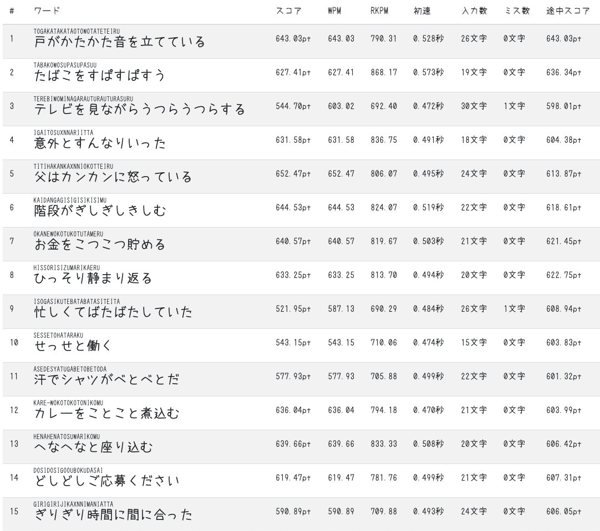

# 設計

## 要件

どうしようかな〜。ワードファイルをアップロードして個人的に練習できるようにするのか、それともワードは固定にするのか…。難しい問題。著作権的な問題もあるかもしれないし、個人的な利用に留めた方が良いのではないか？と。まぁそんなに使われることはないだろうからいいか…。

- e-typingのお題をいつでも練習できるサイト
    - お題のワードのXMLファイルがあるので、それをパースしてDBに保存しておく
    - [e-typingワード](https://uaaaaaaaa.com/typing/word)
- 技術スタック
    - Cloudflare Workersにデプロイする。フロントエンドはReactのSPA、APIは
    - フロントエンド: React（SPA）、Tailwind CSS、TanstackRouter、Tanstack Query
    - API: Cloudflare Workers、tRPC、Prismaよりdrizzle…? 容量制限が気になる

## 機能

アプリ名「タイピングいつでも練習」ダサっ！

ログイン機能

- ユーザーはメールアドレスとパスワードでユーザー登録、ログインをすることができる
- ユーザーはログアウトできる

タイピング練習機能

- ユーザーはお題を選択してタイピング練習することができる
    - タイピング練習では、お題のワードが15問のランダムに出題される
- タイピング練習では、お題の漢字混じり文、ひらがな、ローマ字が表示され、ローマ字を入力する
- タイピング練習が終わったら、練習結果画面を確認できる
- 練習結果画面のサマリでは、スコア、入力文字数、かかった時間、ミス数、WPM、正解率、初速、RKPM（初速抜きのRKPM）が表示される
- 練習結果画面では、各ワードの初速、KPM、RKPM、ミス数、その時点でのスコアが表で確認できる

練習履歴確認機能

- ユーザーは、時系列の降順で表示された練習履歴を確認できる。練習履歴は1ページに20件表示する。
    - 練習履歴の表には、練習結果画面のサマリに表示しているデータが表示される
- ユーザーは、練習履歴の詳細をクリックして、各ワードの結果を確認することができる。

---

まぁe-typingとうあーメモがあればできることなんだけれどね…

とりあえずこんな感じでどうでしょうか。

## 進め方

**準備**

- shadcn/uiを使って画面のモックアップを作成してもらう。いや〜TailwindCSS + htmlでもいいのかな。どっちがいいだろう。
    - 表示する内容について調整しながら仕上げる
    - [Tailwind モック - Search / X](https://x.com/engineerbasulto/status/1943943580722377064/photo/1)　このカタログ風の表示いいですね。
- Cloudflare Workersプロジェクトをセットアップする。1つのリポジトリでフロントエンドと、WorkersのAPIを動かす（前やったやつ）。tRPCでAPIを作成して、疎通を確認する。
- Cloudflareにデプロイして、動いていることを確認する

**タイピング練習機能の実装**

- コアとなるタイピング練習機能を実装する。データの永続化はまだ実装しない。タイピング練習を行って結果を確認できるようにする。
- お題はどうしようかな、先にお題だけデータベースを作っておく必要があるかな。

**データベース作って永続化する**

- データベース設計を行い、マイグレーションをする
- 認証機能を実装し、ユーザー登録、ログイン、ログアウトができるようにする
- タイピング練習結果を登録するAPIを作成し、つなぎ込む
- タイピング練習履歴を取得するAPIを作成し、つなぎ込む

**仕上げ**

- バグ修正等
- APIのテストとか書きながら進めた方がいいのかねぇ

## 画面に表示するデータについて

**お題について**

e-typingには、次のようなお題があります。また、お題に含まれるワードの例も示します。

- お題: 元気が出る言葉
  - ワード: 青空って気持ちいいね、諦めないから叶うのです、諦めることが最大の敗北だ、朝の来ない夜はない
- お題: 数のある言葉
  - ワード: 値千金の逆転打、石の上にも三年、一撃必殺、一難去ってまた一難、一蓮托生
- お題: 擬音・擬態語
  - ワード: 会えなくてがっかりした、足をばたばたさせる、雨が続いてじめじめしている、胃がむかむかする、岩がぼろぼろと崩れる

また、詳細を確認したい場合はwords/ディレクトリのXMLファイルを確認してください。

**練習画面について**

表示するデータを少なく、シンプルにしてください。表示するのは、今何問目か、お題、ワード（漢字混じり分、ひらがな、ローマ字）だけで構いません。

**結果画面について**

装飾を控えめにシンプルにしてください。

表示するデータと具体例については、次の通りです。

- サマリ
  - スコア、入力文字数、かかった時間、ミス数、WPM、正解率、初速、RKPM（初速抜きのRKPM）
  - (例1) 606、329、31.97、2、617.31、99.39、0.500、769.99
  - (例2) 594、327、32.37、2、606.02、99.38、0.513、758.51
- 各ワードの記録
  - 各ワードの初速、KPM、RKPM、ミス数、その時点でのスコアが表で確認できる
  - (例1) 戸がかたかた音を立てている、0.528、643.03、790.31、0、643.03
  - (例2) たばこをすぱすぱすう、0.573、627.41、868.17、0、636.34
  - 続きは以下画像を参照

